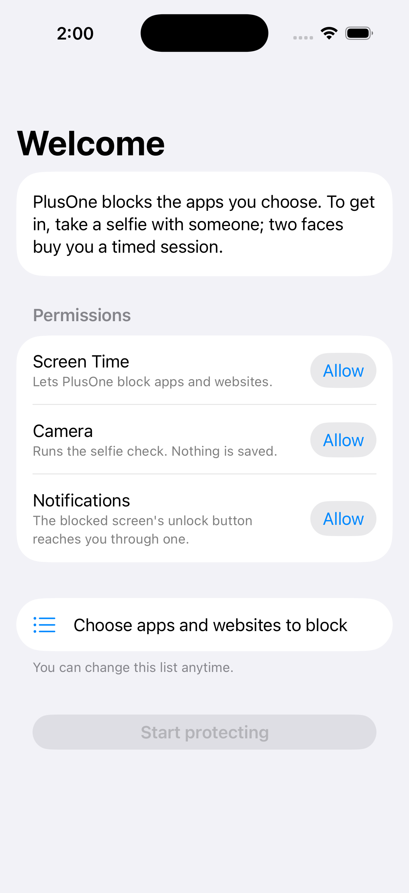
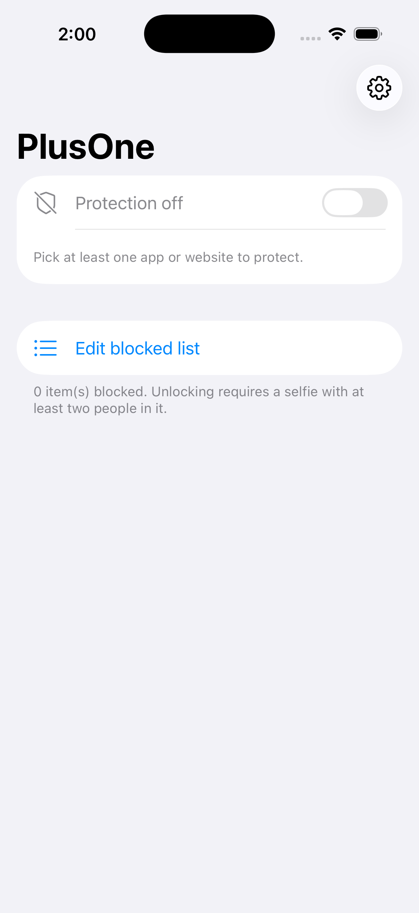

# PlusOne

An iOS commitment device: the apps and websites you choose are blocked unless
you take a selfie with at least two people in it. Pass the check and you get a
timed session (default 5 minutes). When it ends, the block returns on its own.

Doomscroll if you must, but not alone.

<p>
  
  
</p>

## How it works

1. Pick any apps and websites to protect. iOS shields them: opening one shows
   a block screen instead of the app.
2. The block screen has one button: "Unlock with a selfie." It routes into
   PlusOne through a notification tap (shield extensions cannot launch apps
   directly).
3. PlusOne runs a live check on the front camera: at least two faces, each
   large enough to be physically present, held for ~1.5 seconds of continuous
   video. A single face never passes; neither does waving a photo past the
   lens.
4. A pass unshields only the item you were trying to open, for the configured
   number of usage minutes. Re-locking is enforced by the system
   (DeviceActivity), not by the app being alive.

Optional limits: a cooldown between sessions and a daily session cap.

## Anti-tamper

Quitting on impulse is the failure mode, so weakening the setup is slow and
visible:

- **Settings change delay**: any change that weakens protection (removing a
  blocked item, lengthening the unlock duration, turning protection off)
  waits a configurable 1 to 72 hours, with a visible countdown and one-tap
  cancel. Strengthening is always immediate.
- **Delete prevention**: an optional toggle holds the OS app-removal
  restriction, so no app on the device can be deleted while it is on
  (device-wide by iOS design). Turning it off goes through the delay.
- **Friend approval**: pair with one friend through iCloud. Weakening changes
  are sent to their copy of PlusOne in plain language; approval applies the
  change immediately, denial discards it, and silence falls back to the delay
  countdown. Unpairing itself needs approval or the delay.

## Architecture

Four targets, mandated by the Screen Time API design:

| Target | Role |
|--------|------|
| `PlusOne` | SwiftUI app: onboarding, blocked list, selfie check, settings |
| `ShieldUIExtension` | Draws the custom block screen |
| `ShieldActionExtension` | Handles the unlock button; records the request, posts the notification |
| `MonitorExtension` | Ends sessions via usage threshold and interval-end backstop |

State is shared through an App Group. Session limits are enforced by
`DeviceActivity` usage thresholds; a wall clock interval and a
foreground-expiry check back that up. All processing is on-device: no server,
no analytics, and selfie frames are analyzed in memory, never written. Friend
approval syncs through CloudKit (Apple-operated, iCloud accounts, no backend
of ours); the only data that leaves the device is the approval requests and
responses themselves.

## Building

Requires Xcode 15+ and [XcodeGen](https://github.com/yonaskolb/XcodeGen):

```sh
brew install xcodegen
xcodegen generate
open PlusOne.xcodeproj
```

Screen Time features require a physical device and the Family Controls
capability (free for development-signed builds; App Store distribution
requires Apple's entitlement approval). The simulator runs the UI but cannot
shield apps or use the camera.

## Honest limitations

- iOS does not let a self-managed app fully protect itself: revoking
  PlusOne's Screen Time permission in Settings clears every restriction,
  delete prevention included. A friend-held Screen Time passcode closes that
  gap; without one, PlusOne is friction, not a jail.
- The two-face check is a behavioral nudge, not biometric security. A
  sufficiently motivated person can defeat it. That person could also just
  delete the app.
